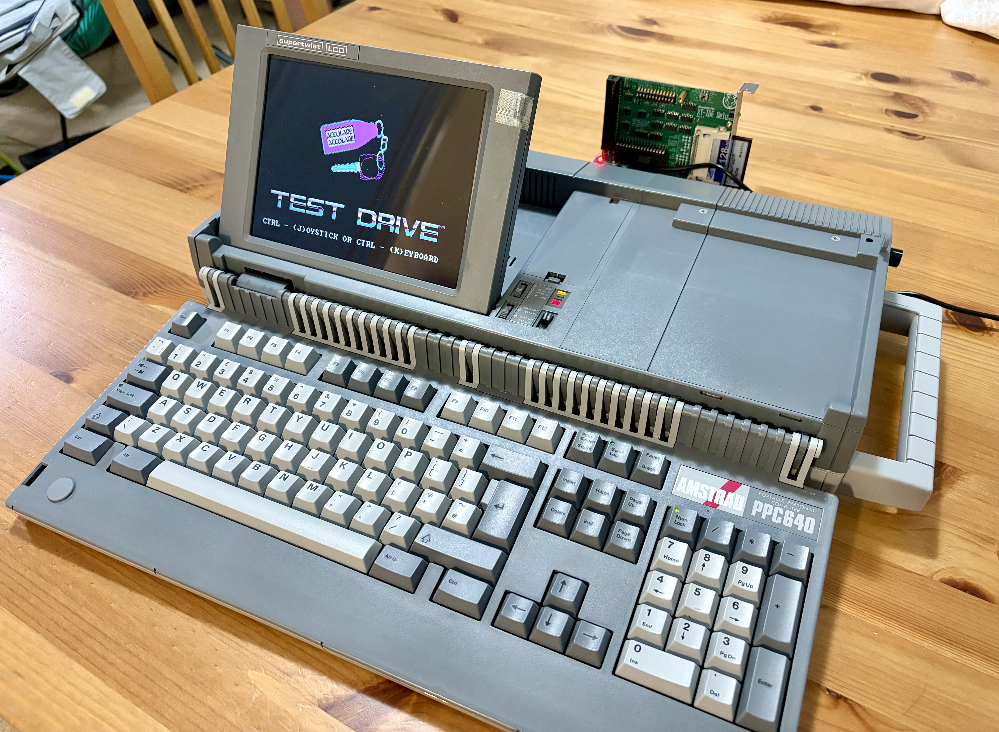
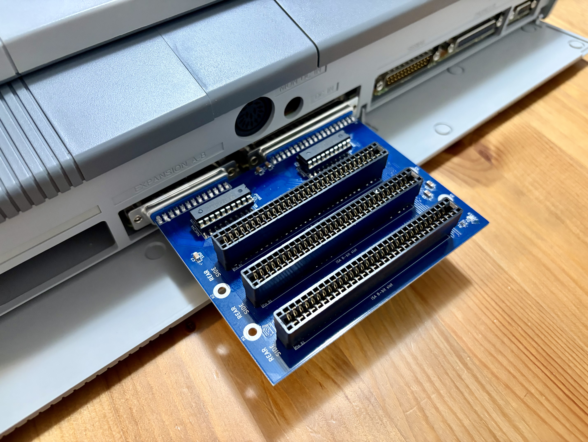
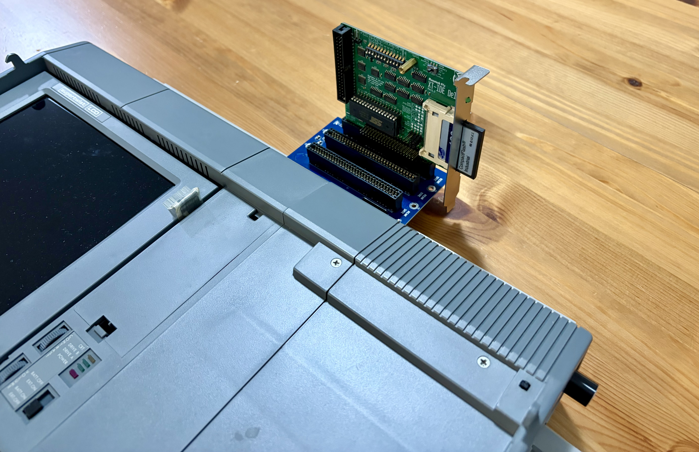
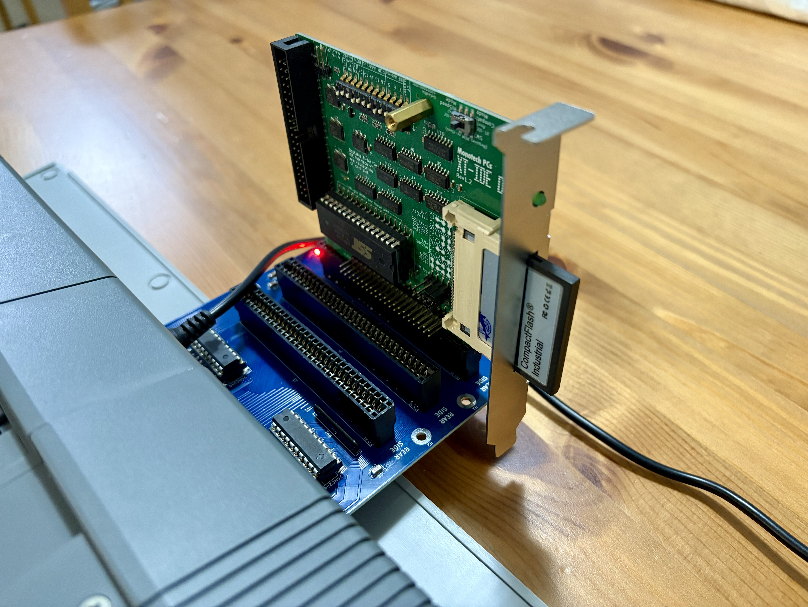

# Amstrad PPC 512/640 — ISA Expansion Board

An open-hardware **KiCad 8** design for an external-mount, internally-powered
**3-slot XT-class (8-bit) ISA expansion board** for the Amstrad PPC 512 and
PPC 640 portable PCs.



The PPC is the 1988-era Amstrad luggable that ships with a CMOS-level
expansion connector (DB25 + DB37) on its back. Amstrad sold an external
"Expansion Box" that was meant to *power* the PPC and add peripheral slots.
This project inverts the original topology: it **takes power from the PPC's
own PSU** and gives you three standard XT 8-bit ISA slots in a compact board
that clips onto the back of the machine via the two DB connectors — ready to
host modern flash-based peripherals (XT-IDE, floppy emulators, network
cards, etc.).

## Gallery

The board has been fabricated and tested in a real Amstrad PPC 640 —
booting DOS from a CompactFlash card via an XT-IDE controller. Photos
below are of the assembled board in service.


| | |
|---|---|
|  |  |
| Board mated to the PPC's DB25 + DB37 expansion port. | Top-down view showing the three ISA slots fanning out the back. |
|  |  |
| XT-IDE card with CompactFlash plugged into the centre slot. | The PPC 640 booting and running Test Drive from the CF card. |

## Repository layout

```
amstrad_isa/
├── README.md                  — this file
├── LICENSE                    — MIT
├── .gitignore                 — KiCad / Python / OS cruft
├── kicad/
│   ├── ppc-isa-expansion.kicad_pro
│   ├── ppc-isa-expansion.kicad_sch
│   ├── ppc-isa-expansion.kicad_pcb
│   ├── sym-lib-table          — project-local symbol libraries
│   ├── fp-lib-table           — project-local footprint libraries
│   └── ppc-isa.pretty/        — custom ISA 8-bit slot footprint
├── scripts/
│   ├── generate_schematic.py  — regenerates the schematic from tables
│   ├── generate_pcb.py        — regenerates the PCB skeleton
│   └── generate_bom.py        — emits docs/BOM.csv
├── fab/                       — ready-to-order gerbers + JLCPCB zip
├── docs/
│   ├── design_notes.md        — the *why* behind the schematic choices
│   ├── BOM.csv                — bill of materials
│   └── Amstrad_PPC_Technical_Reference_Manual.pdf
└── photos/                    — build & in-machine reference shots
```

## I just want a board — no KiCad

If you don't want to install KiCad, the [`fab/`](fab/) folder contains a
ready-to-order gerber set straight from the committed `.kicad_pcb`.

1. Download [`fab/ppc-isa-expansion-gerbers.zip`](fab/ppc-isa-expansion-gerbers.zip)
   (no need to extract it).
2. Go to your favourite board house — **JLCPCB**, **PCBWay**, **OSH Park**
   and **Aisler** all accept this format unchanged.
3. Upload the zip. The defaults are fine: 2 layers, 1.6 mm FR-4, HASL or
   ENIG finish, any colour. Quantity 5 is usually the minimum and runs
   ~$5 + shipping.
4. Order, wait, populate from [`docs/BOM.csv`](docs/BOM.csv).

The gerbers in `fab/` always match the committed `.kicad_pcb`. If you fork
and re-route, re-plot from KiCad and replace the contents of `fab/`.

## Build from source (with KiCad)

```bash
git clone git@github.com:hustav/amstrad_isa.git
cd amstrad_isa

# Optional: regenerate the schematic / PCB from the Python source of truth
python3 scripts/generate_schematic.py
python3 scripts/generate_pcb.py

# Open the project
kicad kicad/ppc-isa-expansion.kicad_pro
```

The `.kicad_sch` and `.kicad_pcb` files were initially **generated** by the
scripts in `scripts/` — those scripts remain the source of truth for the
netlist. The current `.kicad_pcb` has been routed by hand on top of that
skeleton, so re-running `generate_pcb.py` would overwrite the routing.
If you need to change the netlist, regenerate the skeleton and then redo
the affected traces.

## Key design choices

| Area | Choice | Reason |
| --- | --- | --- |
| Form factor | External-mount, ~120 × 99 mm | Clips onto the PPC's DB25 + DB37 expansion port |
| Slots | 3 × XT 8-bit ISA (62-pin) | Standard pinout, matches prior-art boards |
| Power source | Drawn from the PPC's internal PSU via the expansion cable | No external brick required |
| −5 V rail | Taken directly from connector B pin 17 | Tech Ref §1.18 confirms PPC sources −5 V |
| Component style | SMD only — SOIC, 0805, SIP network | Hand-solderable with a fine-tip iron |
| Buffering | 2 × 74HC244 for A00..A07 + 8 control signals | Drives the loaded capacitance of 3 ISA slots |
| Data bus | Unbuffered, 10 kΩ pull-ups via RR1 | Per Amstrad Tech Ref CMOS-to-TTL note |
| Activity LED | Removed (BEAT flip-flop omitted) | Purely cosmetic; saves 1× SOIC-14 + RC bits |

Full rationale lives in [docs/design_notes.md](docs/design_notes.md).

## Power topology — important caveat

The Amstrad PPC Technical Reference Manual (§1.18) states that the original
Expansion Box is intended to *supply* power **to** the PPC, not draw from
it. Connector B pin 20 is an **EXT PWR input** to the PPC's regulator.

This design **reverses that flow** — all four rails (+5 V, +12 V, −5 V,
−12 V) are *drawn* from the PPC's expansion connector:

- +5 V from connector A pin 1 and connector B pin 37
- +12 V from connector B pin 36
- −5 V from connector B pin 17
- −12 V from connector B pin 18

Pin 20 (EXT PWR into the PPC) is **left floating** — voltage is never
injected back into the PPC.

**Safe for modern peripherals.** An original floppy or 10 MB Winchester drew
5–10 W. A flash-based XT-IDE with a CF card draws ~100–200 mA on +5 V
(0.5–1 W). Three flash peripherals are comfortably within the headroom the
original PSU left for the Expansion Box port.

**Not safe for original drives.** If you try to use the original floppy or
HDD controllers through this board, the PPC's PSU may brown out. In that
case, build an externally-powered (ATX) variant instead.

## Amstrad expansion pinout (Tech Ref §1.18)

### Connector A (DB25 male on the board)

Mostly the address bus.

| Pin | Signal | Notes |
| --- | --- | --- |
| 1 | +5 V | **power input** |
| 2 | TC | DMA terminal-count |
| 3, 16, 4, 17, 5, 18, 6, 19, 7, 20, 8, 21 | A19..A08 | Unbuffered |
| 9, 22, 10, 23, 11, 24, 12, 25 | A07b..A00b | Buffered on PPC side; re-buffered by U2 |
| 13 | AEN | Address enable |
| 14 | GND | |
| 15 | DACK0 | |

### Connector B (DB37 male on the board)

Data bus, IRQs, DMA, control signals, power.

| Pin | Signal | Notes |
| --- | --- | --- |
| 1 | −20 V | **unused, left NC** |
| 2–4, 21–23 | IRQ2..IRQ7 | Pass-through |
| 5 | I/O RDY | Pass-through |
| 6, 24–25 | DACK1..DACK3 | Pass-through |
| 7 | I/O CHCK | Pass-through |
| 8, 26–27 | DRQ1..DRQ3 | Pass-through |
| 9 | OSC(b) | 14.318 MHz buffered on PPC side; re-buffered by U1 |
| 10–12, 28–31 | MEMR(b), IOR(b), ALE(b), MEMW(b), IOW(b), RESET(b), CK4(b) | Re-buffered by U1 |
| 13–16, 32–35 | D7..D0 | Unbuffered; 10 kΩ pull-ups via RR1 |
| 17 | −5 V | **power input** |
| 18 | −12 V | **power input** |
| 19 | GND | |
| 20 | EXT PWR | **NOT USED** — would feed the PPC's regulator |
| 36 | +12 V | **power input** |
| 37 | +5 V | **power input** |

The full Amstrad PPC Technical Reference Manual is included in
[docs/](docs/Amstrad_PPC_Technical_Reference_Manual.pdf) for reference.

## Credits and prior art

This design builds on two community projects, both of which are
externally-mounted boards that hang off the PPC's DB25 + DB37 connectors:

- **João (enide.net)** — original internally-powered design. Provided the
  mechanical approach and power topology. Only the gerbers were available
  (the project is currently offline), so the schematic was reverse-
  engineered from those files and cross-referenced against the
  Retrotheory design below.
- **Retrotheory — [amstradppc_expansion](https://github.com/retrotheory/amstradppc_expansion)** —
  ATX-powered variant. Provided the full schematic used as the electrical
  reference (74HC244 pinouts, the BEAT LED divider using a 74HC74, etc.).

Many thanks to both for sharing their work — without them this design
would not exist.

## License

Released under the **MIT License**. See [LICENSE](LICENSE).
